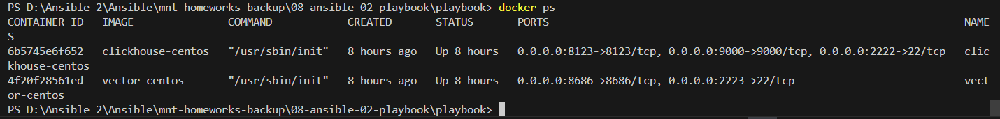
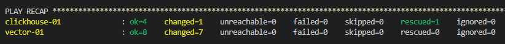
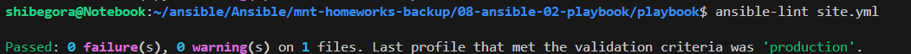
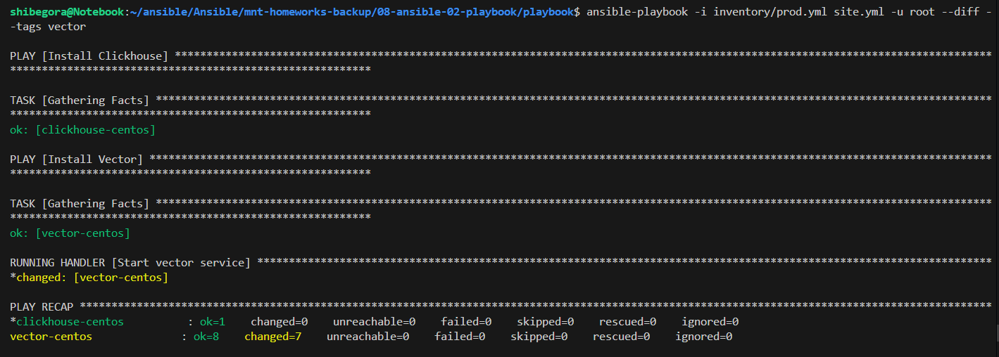
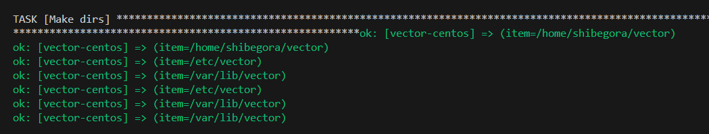
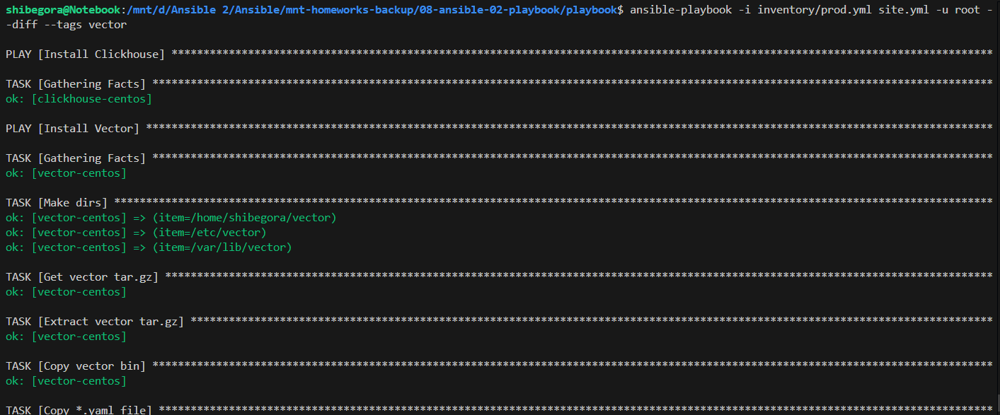

Данный playbook выполняет развертывание ClickHouse и Vector на хосты под управлением CentOS7

В инвентори файле ./inventory/prod.yml добавлены необходимые хосты

Таски ClickHouse и Vector разделены тэгами, чтобы можно было раскатывать их отдельно друг от друга.

Для создания базы данных clickhouse добавлен дополнительный тег make-db для отдельного запуска таска по причине того, что таск часто падает в ошибку, вероятно, из-за того, что служба clickhouse не успевает запуститься.

Для разворачивания был использован докер и созданы контейнеры на локальном ПК. 

## Версия

Пакеты Clickhouse v22.3.3.44
Vector-0.42.0 на данный момент последняя версия продукта

## Файлы конфигурации vector
Во время раскатки плэйбука для vector подкидываются темплейты конфигурации и службы с нужными переменными, необходимыми для функционирования приложения.
В папке ./template находятся jinja2 файлы конфигов
Переменные располагаются в ./vector/vars.yml
Файл конфигурации копируется в /etc/vector/vector.yaml
Сервис создается в /etc/systemd/system/vector.service
Бинарный файл vektor копируется в /usr/bin/

### Пункт 2

### Пункт 5
Проверка ansible-lint

После исправления ошибок

### Пункт 6

При запуске плэйбука с флагом --check, ansible иммитирует раскатку роли на хост, но при попытке выполнить распаковку архива в каталог, который он не создал, роль падает в ошибку отсутствия каталога. Если запустить плэйбук с этим флагом уже после того как роль была раскатана, всё проходит без ошибок

### Пункт 7
При запуске плэйбука с флагом --diff наглядно видны все изменения

### Пункт 8
При повторном запуске плэйбука с флагом --diff никаких изменений не вносится. Это и означает, что playbook аналогичный.
